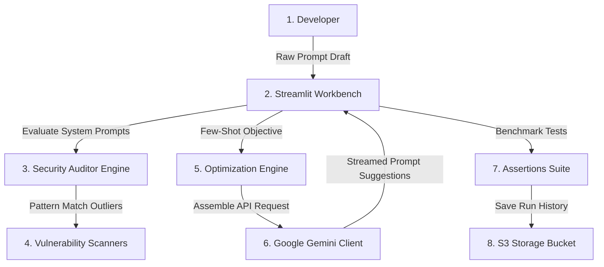
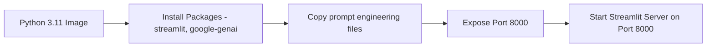
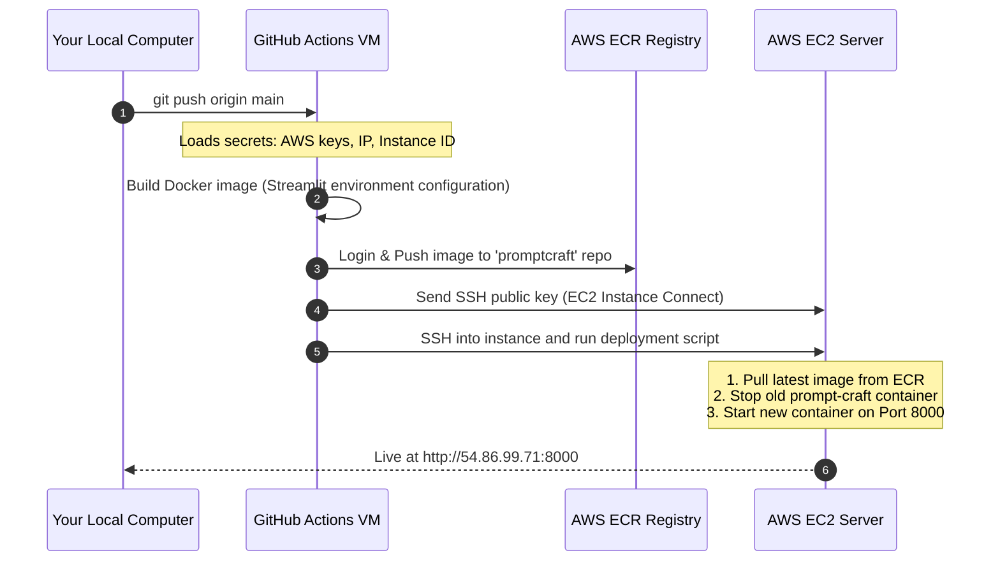

# prompt-craft: MLOps and Deployment Guide

This document provides a beginner-friendly explanation of how the **prompt-craft** application works, how it is packaged using Docker, and how it is deployed automatically to AWS using GitHub Actions.

---

## 1. How prompt-craft Works (The Workbench Flow)

PromptCraft is an interactive prompt engineering and security audit workbench. It helps developers write robust LLM instructions by scoring prompt quality, running vulnerability scans (jailbreak/leakage detection), generating few-shot examples automatically, and benchmarking output token counts and latencies across models.

### The System Architecture Flow:


---

## 2. Code Structure

PromptCraft is built entirely around Python and Streamlit, making it dynamic and visual.

```text
prompt-craft/
├── app.py                  # Main Streamlit web application dashboard
├── client.py               # Google Gemini client and streaming wrapper
├── prompt_analyzer.py      # Security scanners (regex/injection checks)
├── test_utils.py           # Automated test assertions evaluator
├── config.py               # Settings & API key loaders
├── Dockerfile              # Streamlit container configuration
└── requirements.txt        # Package dependencies (streamlit, google-genai)
```

---

## 3. The Docker Blueprint (How We Containerize)

We use a simple and lightweight Docker container configured specifically to run Streamlit on port `8000`:



### Why we do this:
* **Streamlit Configuration:** By default, Streamlit runs on port `8501`. We use the flag `--server.port 8000` inside our Dockerfile CMD to map it to port `8000` so that it conforms to our EC2 firewall standards.
* **Direct UI Loading:** The container runs the frontend process directly. You do not need a separate backend server because Streamlit binds the Python logic directly to the web interface.

---

## 4. The GitHub Actions CD Pipeline (Continuous Deployment)

When you run `git push origin main`, GitHub starts a temporary virtual machine to execute the assembly line defined in `.github/workflows/deploy.yml`:



---

## 5. AWS Cloud Components

prompt-craft relies on these core AWS services:
1. **AWS ECR (Elastic Container Registry):** A private cloud folder where your built Docker image is stored.
2. **AWS EC2 (Elastic Compute Cloud):** A virtual server (`t3.micro`) running Ubuntu 22.04 that downloads and hosts the Docker container.
3. **AWS Security Group:** An inbound firewall rule configured to open **Port 8000** (so you can view the dashboard UI) and **Port 22** (for secure SSH management).
4. **AWS S3 (Simple Storage Service):** Used by the application to store prompt history run metrics and benchmark logs.
