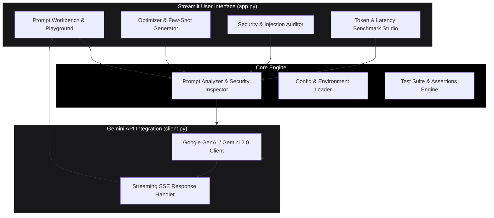
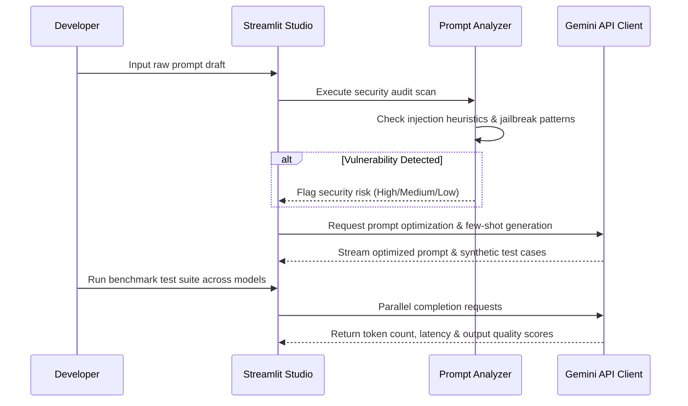

# PromptCraft -- Interactive Prompt Engineering & Security Audit Studio

PromptCraft is an interactive prompt engineering, optimization, and security audit studio built with **Streamlit** and the **Google Gemini API**. It enables developers to refine raw prompts, automatically inject few-shot examples, audit prompts against security vulnerability heuristics (prompt injection, jailbreaks, data exfiltration), and evaluate multi-model token benchmarks.

---

## Architecture Topology



---

## Prompt Optimization & Audit Sequence Diagram



---

## Key Features

- **Automated Prompt Optimization**: Transforms vague instructions into structured, system-role optimized prompts with automatically generated few-shot examples.
- **Prompt Security & Jailbreak Audit**: Scans inputs for prompt injection techniques, indirect jailbreaks, and system prompt leakage risks.
- **Multi-Model Comparison Playground**: Runs side-by-side completions to compare latency, token usage, and output quality across model variants.
- **Automated Test Assertions**: Defines verification rules (JSON schema validation, regex matching, keyword inclusion) to test prompt reliability.

---

## Directory Structure

```
prompt-craft/
|-- app.py                  # Main Streamlit web application & tabbed UI
|-- client.py               # Google Gemini API client & response parser
|-- config.py               # Settings, model defaults, & environment variables
|-- prompt_analyzer.py      # Security audit rules & prompt injection analyzer
|-- test_utils.py           # Test suite execution & assertion evaluator
|-- requirements.txt        # Streamlit, google-generativeai, python-dotenv dependencies
|-- .env.example            # API Key configuration template
|-- README.md               # ASCII Architecture & User Documentation
`-- .gitignore              # Git ignore rules
```

---

## Quick Start Guide

### Prerequisites
- Python 3.10+
- A **Google Gemini API Key**

### Local Setup

1. **Clone Repository**:
   ```bash
   git clone https://github.com/siddarth1872004/prompt-craft.git
   cd prompt-craft
   ```

2. **Install Dependencies**:
   ```bash
   pip install -r requirements.txt
   ```

3. **Configure API Key**:
   ```bash
   cp .env.example .env
   # Edit .env and insert GEMINI_API_KEY=your_key_here
   ```

4. **Launch Streamlit App**:
   ```bash
   streamlit run app.py
   ```

5. **Open in Browser**:
   Navigate to `http://localhost:8501`.

---

## License

Distributed under the **MIT License**. See `LICENSE` for details.
